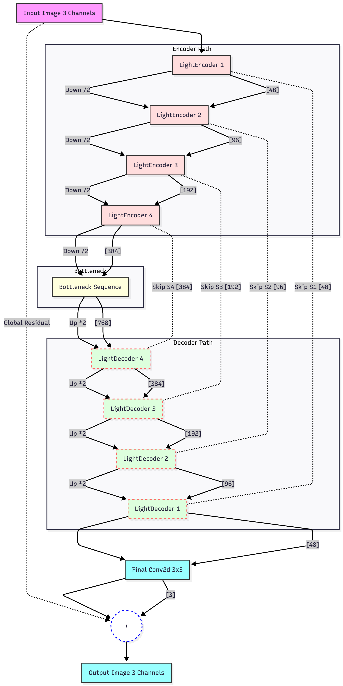
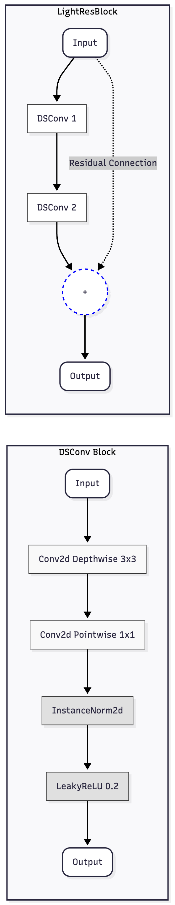
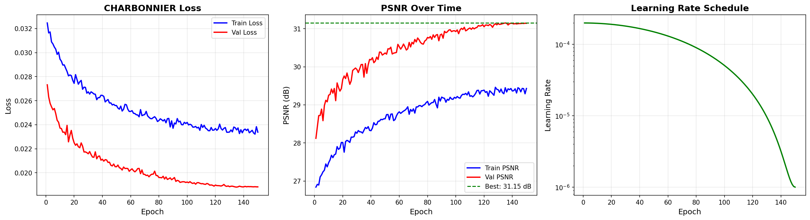
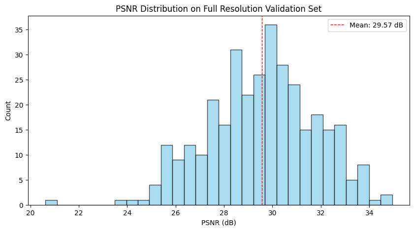
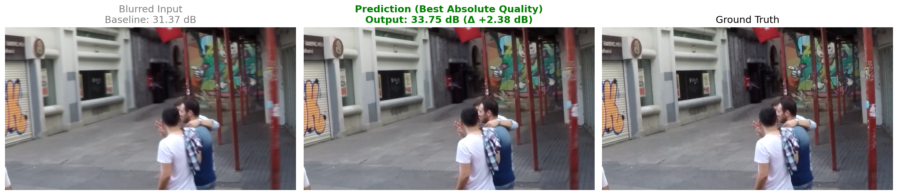
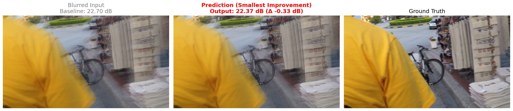
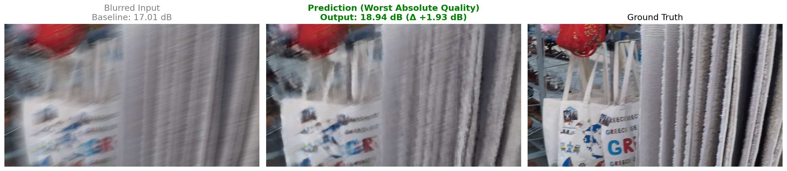
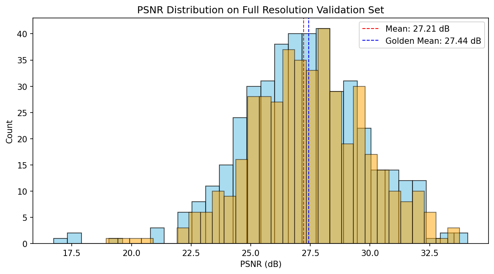
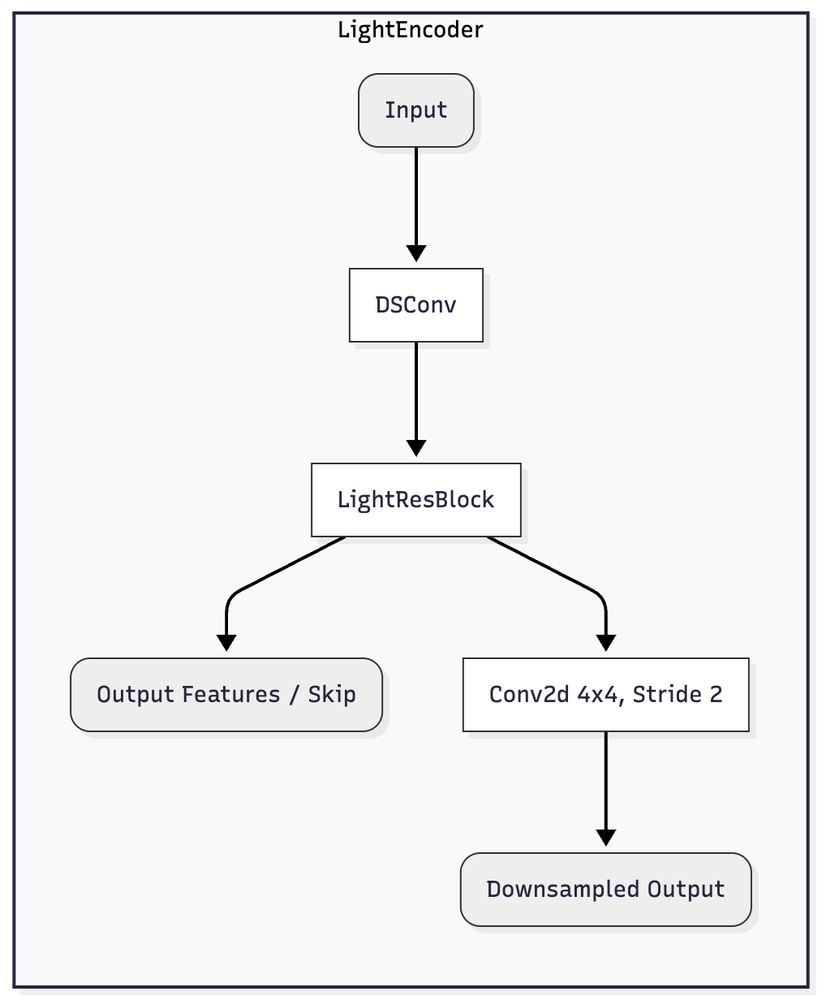
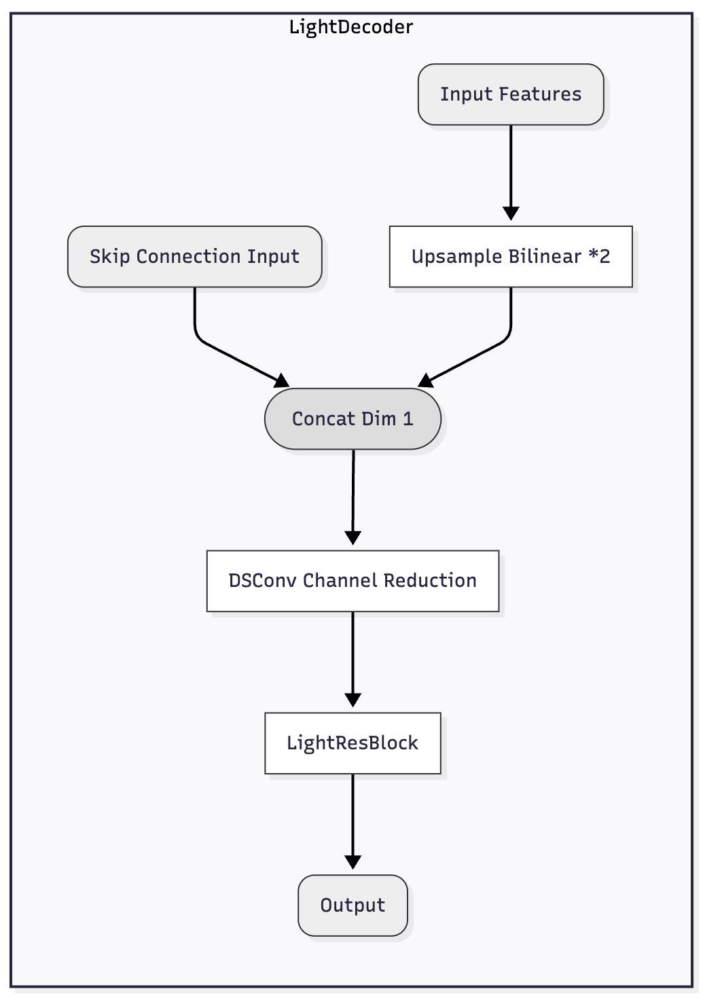

# Image deblurring with limited computation ressources

**Author:** Gabriel  
**Date:** November 29, 2025  
**Project:** CNN Image Deblurring (GoPro Dataset)

---

## 📄 Abstract

This study presents a lightweight Convolutional Neural Network (CNN) for single-image deblurring, designed to operate efficiently on consumer-grade hardware. By leveraging **Depthwise Separable Convolutions** and a **Global Residual Learning** strategy, we achieve a model with approximately **6.8 million parameters**—a massive reduction from standard U-Net architectures (~30M)—while maintaining high reconstruction quality. Our final model achieves a Peak Signal-to-Noise Ratio (PSNR) of **31.15 dB** on the GoPro dataset validation split, demonstrating that efficient architecture design combined with rigorous training strategies (Cosine Annealing, Sequence Splitting) can yield state-of-the-art competitive results with limited computational resources.

---

## 1. Introduction

Image deblurring is a classic ill-posed problem in computer vision, where the goal is to recover a sharp image $y$ from a blurred observation $x$. While deep learning approaches have shown remarkable success, they often rely on heavy architectures requiring massive GPU memory.

This project addresses the challenge of deploying effective deblurring models on constrained hardware (e.g., Apple Silicon MPS, Google Colab Free Tier). Our objective was to design a "Lightweight" U-Net capable of surpassing a PSNR threshold of **28.5 dB** on the GoPro dataset, optimizing for both parameter efficiency and inference speed.

**Context:** This project was developed as part of an AI competition. A separate, hidden Test Set will be released shortly to evaluate the model's performance in a completely unbiased manner.

---

## 2. Methodology

### 2.1. Network Architecture: Lightweight U-Net


*Figure 5: High-level U-Net architecture showing the Encoder-Decoder structure and the Global Residual connection.*

We adopted a U-Net architecture modified for efficiency. The core innovation lies in the replacement of standard convolutions with **Depthwise Separable Convolutions (DSConv)**.

#### 2.1.1. Depthwise Separable Convolutions


*Figure 6: Animation illustrating the Depthwise Separable Convolution process.*

A standard convolution with kernel size $K \times K$, $C_{in}$ input channels, and $C_{out}$ output channels has a computational cost proportional to:

```math
P_{std} = K^2 \cdot C_{in} \cdot C_{out}
```

A DSConv splits this operation into two distinct layers:
1.  **Depthwise Convolution:** Applies a single filter per input channel ($C_{in}$ groups).
2.  **Pointwise Convolution:** A $1 \times 1$ convolution to mix the channels.


*Figure 7: Detailed structure of the DSConv block and the LightResBlock.*

The parameter count becomes:

```math
P_{ds} = (K^2 \cdot C_{in}) + (C_{in} \cdot C_{out})
```

For a $3 \times 3$ kernel, this yields a reduction factor of approximately $\frac{1}{8}$ to $\frac{1}{9}$, allowing us to increase the network depth and width (starting filters = 48) without exploding the model size.

#### 2.1.2. Global Residual Learning
We observed in early experiments (Run V1) that standard U-Nets often converge to the **Identity Function** ($f(x)=x$) because the blurred input and sharp output are statistically very similar. This is known as the "Identity Trap".

To counter this, we formulated the network to predict the **residual** (the blur noise) rather than the image itself:

```math
\hat{y} = x + \mathcal{F}(x)
```

where $x$ is the blurred input and $\mathcal{F}(x)$ is the residual learned by the U-Net.

*   **Implementation:** A skip connection adds the input directly to the output.
*   **Initialization:** The final convolution layer weights are initialized to **zero**. This ensures that at epoch 0, $\mathcal{F}(x) \approx 0$, and thus $\hat{y} \approx x$. The optimization process then starts from the identity mapping and learns to subtract the blur.

### 2.2. Loss Function: Charbonnier Loss

We utilized the **Charbonnier Loss** (a differentiable variant of L1 loss). Unlike MSE (L2), which penalizes large errors heavily and leads to oversmoothed images, Charbonnier Loss is more robust to outliers and preserves edges better.

```math
\mathcal{L}(y, \hat{y}) = \sqrt{(y - \hat{y})^2 + \epsilon^2}
```

with $\epsilon = 10^{-3}$.

### 2.3. Training Strategy

#### 2.3.1. Sequence-Based Data Splitting
Initially, we utilized the original dataset split, which allocated a significant portion (~33%) of the data to validation. While robust, this limited the amount of data available for training.

To maximize the training set size without compromising evaluation integrity, we created a custom split. However, a simple random shuffle would introduce **Data Leakage**, as the GoPro dataset consists of video sequences; adjacent frames are nearly identical. If frame $t$ is in Train and frame $t+1$ is in Validation, the model effectively "memorizes" the answer.

We implemented a strict **Sequence Split**:
*   Images are grouped by their parent video sequence.
*   Entire sequences are assigned to either Train or Validation (approx. 85% Train / 15% Val).
*   **Result:** The validation set contains scenes completely unseen during training, providing a true measure of generalization while allowing the model to learn from more data.

#### 2.3.2. Scheduler: Cosine Annealing
In Run V1, we used `ReduceLROnPlateau`, which resulted in premature stagnation. For the final model, we switched to `Cosine Annealing LR`. This scheduler follows a cosine curve to decay the learning rate from $\eta_{max} = 2 \cdot 10^{-4}$ to $\eta_{min} = 10^{-6}$ over 150 epochs. This forces the model to settle into a sharp local minimum at the end of training.

---

## 3. Experiments & Results

Detailed implementation can be found in `train_experiments.ipynb`.

### 3.1. Experimental Setup
*   **Dataset:** [GoPro Large Dataset](https://seungjunnah.github.io/Datasets/gopro) (~2k training pairs, ~1k validation pairs).
*   **Hardware:** Apple M3, 16Gb RAM (MPS Acceleration).
*   **Input:** 256x256 Random Crops (Train), 256x256 Center Crops (Val).
*   **Optimizer:** AdamW (`weight_decay=1e-3`).

### 3.2. Ablation Studies & Run History

Detailed logs can be found in `notes.md`.

*   **Note on Validation Sets:**
    *   **Runs V1 & V2:** Used the original dataset split (~1k validation images). **Correction:** In these early runs, rotation augmentation was accidentally enabled for the validation set, which artificially lowered the validation scores as the model had to handle random orientations during evaluation.
    *   **Runs V3 & V4:** Used the new **Sequence Split** logic (approx. 15% validation), which is still rigorous and prevents data leakage.

| Experiment | Config | PSNR (Val) | Key Observation |
| :--- | :--- | :--- | :--- |
| **Run V1** | 32 Filters, Plateau Scheduler | 27.50 dB | Baseline. Convergence issues. |
| **Run V2** | 48 Filters, Cosine Scheduler | 28.03 dB | Improved capacity & convergence. |
| **Run V3** | **V2 + Sequence Split + Fixes** | **31.15 dB** | **Best Model.** Corrected validation pipeline. |
| **Run V4** | V3 with Seed 123 | 27.21 dB | Robustness check on a harder validation split. |
| **No-Norm** | V3 w/o InstanceNorm | ~26.00 dB | Failed to converge. InstanceNorm is crucial. |

#### Training Dynamics (Run V3)

*Figure 1: Training metrics for the best model. Note the smooth convergence of PSNR facilitated by the Cosine Annealing scheduler.*

### 3.3. Qualitative Results
The model effectively removes motion blur while preserving structural details.
*   **Run V3 (Best):** Achieved **31.15 dB** on the validation crop set and **29.57 dB** on the full-resolution dataset.
*   **Generalization:** The gap between Training and Validation PSNR was closed by the sequence splitting strategy and data augmentation (random rotations, soft color jitter).

#### Visual Comparison

*Figure 2: Validation samples. The model successfully restores sharp edges and text details from heavily blurred inputs.*

#### PSNR Distribution (Run V3)

*Figure 3: Distribution of PSNR scores on the full-resolution validation set.*

#### Extreme Cases Analysis
We analyzed specific examples including best and worst performance cases to understand the model's limits.






### 3.4. Robustness Analysis: The Seed Effect (V3 vs V4)

To verify that our results were not due to a "lucky" data split, we trained a second model (**Run V4**) with an identical configuration but a different random seed (`123` vs `42`). This changed which video sequences were assigned to Train vs Validation.

*   **V3 (Seed 42):** 31.15 dB Val PSNR.
*   **V4 (Seed 123):** 27.21 dB Val PSNR.

At first glance, V4 seems worse. However, when we evaluated the **V3 model on the V4 validation split**, its performance dropped to **27.44 dB**. This confirms that the V4 validation split is intrinsically "harder" than V3's.


*Figure 4: PSNR Distribution comparison on the V4 Validation Set. The V4 model (Blue) performs comparably to the V3 "Golden" model (Orange).*

**Crucial Observation on Generalization:**
The V3 model achieves 27.44 dB on the V4 split, which is slightly higher than V4's 27.21 dB. However, this comparison is biased in favor of V3. Since the splits are random, **some sequences in the V4 Validation set were likely present in the V3 Training set**.
*   V3 is likely "reciting" some images it has seen before (Data Leakage in this specific cross-evaluation).
*   V4 is seeing these images for the first time.
*   The fact that V4 performs almost as well as V3 (despite V3's unfair advantage) strongly suggests that **V4 generalizes better** and that the architecture is robust.

---

## 4. Usage

### 4.1. Installation
```bash
python -m venv .venv
source .venv/bin/activate
pip install torch torchvision torchaudio matplotlib tqdm pillow numpy
```

### 4.2. Training
To reproduce the results of **Run V3**:
```bash
python src/train.py \
  --data_root ./data \
  --experiment_name unet_light_v3 \
  --start_filters 48 \
  --batch_size 8 \
  --epochs 150 \
  --loss charbonnier
```

### 4.3. Inference
The `inference.py` script supports **Tiled Inference** to handle high-resolution images (HD/4K) without memory errors.

```bash
# Generate a side-by-side comparison (Input vs Output)
python src/inference.py --input path/to/blurred.png --output comparison.png --test

# Process an entire folder
python src/inference.py --input ./data/test/blur --output ./results
```

---

## 5. Conclusion

We successfully developed a lightweight deblurring model that achieves high performance (**31.15 dB PSNR**) through architectural efficiency and rigorous training methodology. The use of **Global Residual Learning** and **Cosine Annealing** were critical factors in overcoming the optimization difficulties inherent in image restoration. The failure of the "No-Norm" experiment confirms that for this specific lightweight architecture, Instance Normalization is essential for stability.

---

## 🎓 Personal Reflection & Learning Journey

This project marks my **first deep learning project using PyTorch**. Starting with only basic knowledge of CNNs for image classification, I had to learn advanced concepts "on the fly" to solve the specific challenges of image restoration.

### Hardware Constraints & Determination
The entire project was developed and trained locally on a **MacBook Air** (using MPS acceleration).
*   **Why not Cloud?**
    1.  **Timeouts:** Google Colab's free tier times out after ~2 hours of GPU usage, which was insufficient for convergence.
    2.  **Software Engineering Principles:** Coming from a Software Engineering background, I prefer keeping code modular and tidy. Colab often encourages a "monolithic notebook" approach where everything is dumped into one file. Developing locally allowed me to structure the project properly (separating `src/` modules, training scripts, and notebooks), even though the trial-and-error nature of Data Science makes maintaining clean code challenging.
*   **The Cost of Local Training:** Training a single run took between **800 and 1370 minutes** (approx. 13 to 23 hours). The limited number of total experiments reflects this high time cost per iteration.

### Key Learnings
Transitioning from classification to restoration required unlearning standard practices:
1.  **No Max Pooling:** In classification, pooling reduces dimensions to find "what" is in the image. In deblurring, we need to preserve "where" everything is. We used **Strided Convolutions** instead to downsample while learning spatial features.
2.  **No Dropout:** Dropout destroys spatial information and introduces noise. For pixel-perfect reconstruction, this is detrimental. We relied on **Data Augmentation** and **Weight Decay** for regularization instead.
3.  **The Power of Residuals:** My first attempts failed to converge (stuck at identity). Understanding that it's easier for a network to learn "zero" (the noise) than "everything" (the image) was the turning point that allowed the model to work.
4.  **Encoder-Decoder Architecture:** I grasped the intuition behind using an Encoder-Decoder structure for reconstruction. The **Encoder** compresses the image into a compact latent representation (capturing the semantic "context"), while the **Decoder** learns to reconstruct the spatial details from this representation. The skip connections bridge these two worlds, allowing the decoder to recover fine details lost during downsampling.

### Time Constraints & Future Scope
This entire project was completed in **one week**. Given this tight timeframe and hardware limitations, I had to prioritize a robust baseline over extensive hyperparameter tuning.
*   **With more resources (Powerful GPUs):** I would have liked to explore and fine-tune the hyperparameters of the learning tools and the architecture more deeply.
*   **With more time:** I would have liked to generate more blurry images from sharp images to augment the dataset, but I did not have time to pursue those ideas.

---

## 📂 Project Structure
```
.
├── data/                   # GoPro Dataset
├── experiments/            # Checkpoints and logs
├── src/
│   ├── dataset.py          # GoProDataset class (Sequence Split logic)
│   ├── train.py            # Training script
│   ├── inference.py        # Tiled Inference script
│   ├── evaluate.py         # Evaluation metrics
│   ├── models/
│   │   ├── unet.py         # Standard U-Net (Reference)
│   │   └── lightunet.py    # Optimized Lightweight U-Net
│   └── utils/
│       └── metrics.py      # PSNR calculation
├── train_experiments.ipynb # Development notebook
├── notes.md                # Detailed Development Log
└── README.md               # This Report
```

### Parameter Count Analysis

#### Component Cost (Example at C=48)
To illustrate the efficiency, we compare the parameter cost of our building blocks against standard convolutions for a feature map of 48 channels:

*   **Standard Conv (3x3):** $9 \cdot C^2 \approx 20,736$ params
*   **DSConv (3x3):** $1 \cdot 9 \cdot C + C \cdot C \approx 2,832$ params (**~86% reduction**)
*   **LightResBlock:** $2 \times \text{DSConv} \approx 5,664$ params

This efficiency allows us to maintain a deep architecture (4 levels) with a large channel width (up to 768 in the bottleneck) while keeping the total count under 7M.

**Configuration:** `start_filters = 48`


*Figure 8: Structure of the LightEncoder block.*


*Figure 9: Structure of the LightDecoder block.*

| Section | Input Channels | Output Channels | Operation | Approx Params |
| :--- | :--- | :--- | :--- | :--- |
| **Encoder 1** | 3 | 48 | DSConv + ResBlock + Downsample | ~43k |
| **Encoder 2** | 48 | 96 | DSConv + ResBlock + Downsample | ~173k |
| **Encoder 3** | 96 | 192 | DSConv + ResBlock + Downsample | ~687k |
| **Encoder 4** | 192 | 384 | DSConv + ResBlock + Downsample | ~2.74M |
| **Bottleneck** | 384 | 768 | DSConv + ResBlock + DSConv | ~2.10M |
| **Decoder 4** | 768 + 384 | 384 | Fusion + ResBlock | ~757k |
| **Decoder 3** | 384 + 192 | 192 | Fusion + ResBlock | ~194k |
| **Decoder 2** | 192 + 96 | 96 | Fusion + ResBlock | ~51k |
| **Decoder 1** | 96 + 48 | 48 | Fusion + ResBlock | ~14k |
| **Output** | 48 | 3 | Conv 3x3 | ~1.3k |

**Total Trainable Parameters:** ~6.75 Million

*Note: The largest contribution comes from the standard convolution used for downsampling in the deeper layers (Encoder 4), which was kept as a standard convolution to preserve spatial information.*

---
